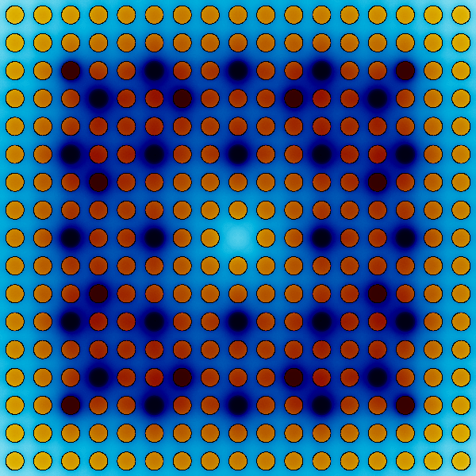
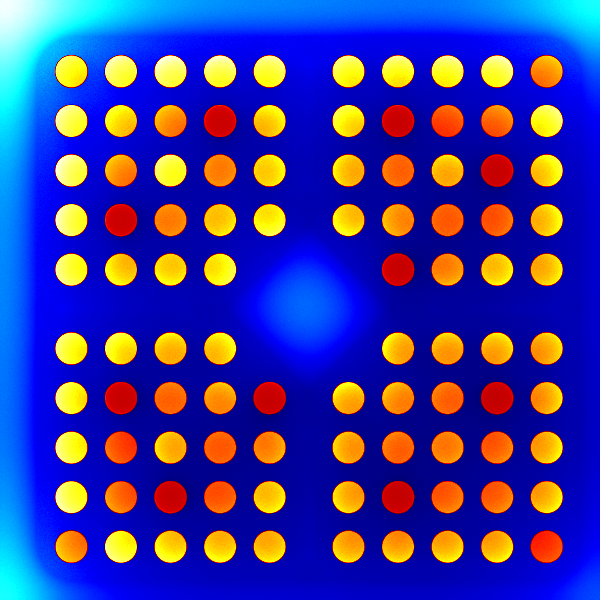

---
title: |
 | A free and open source computational tool for solving
 | (nuclear-related) differential equations in the cloud
author: German (a.k.a. Jeremy) Theler
email: gtheler@seamplex.com
institute: |
 | International Nuclear Atlantic Conference
 | Round Table 4 ENFIR Best Estimate codes and methods
 | for Reactor Physics, Thermal Fluid Dynamics and Fuel Behavior
aspectratio: 169
lang: en-US
theme: default
innertheme: rectangles
fonttheme: professionalfonts
outertheme: number
colorlinks: true
sansfont: Carlito
monofont: DejaVuSansMono
header-includes: \include{syntax.tex}
...


# Why $\rightarrow$ How $\rightarrow$ What

   
\centering 

\centering <https://www.youtube.com/watch?v=u4ZoJKF_VuA>

# 

\centering 

# IAEA 2D/3D PWR benchmark (1976)

:::::::::::::: {.columns}
::: {.column width="40%"}
{width=90%}
:::

::: {.column width="60%"}
{width=85%}
:::
::::::::::::::

# Vertical PHWR (Atucha)

:::::::::::::: {.columns}
::: {.column width="50%"}
\centering {width=70%}
:::

::: {.column width="50%"}
\centering {width=60%}
:::
::::::::::::::


# Fuel elements


:::::::::::::: {.columns}
::: {.column width="33%"}

:::

::: {.column width="34%"}

:::

::: {.column width="33%"}

:::
::::::::::::::


# Steady-state core-level neutronic calculations

:::::::::::::: {.columns}
::: {.column width="50%"}
\centering {width=60%}
:::

::: {.column width="50%"}
\centering {width=60%}
:::
::::::::::::::


:::::::::::::: {.columns}
::: {.column width="33%"}
{width=80%}
:::

::: {.column width="34%"}
{width=80%}
:::

::: {.column width="33%"}
{width=70%}
:::
::::::::::::::


# Transient emergency boron injection---CFD

\centering 


# Transient emergency boron injection---core-level neutronics

:::::::::::::: {.columns}
::: {.column width="50%"}
\centering {width=80%}
:::

::: {.column width="50%"}
\centering {width=80%}
:::
::::::::::::::


# Transient emergency boron injection---cell-level neutronics


\centering {width=70%}


\centering {width=80%}


#

\centering 


# A little bit of history---College (2004-2008) (v1)

 * Solve $\dot{\mathbf{x}} = F(\mathbf{x},t)$
    
    a. program an _ad-hoc_ numerical method
    b. use a standard numerical library in C or Python, or
    c. use a high-level system such as [Octave](https://www.gnu.org/software/octave/index), [Maxima](https://maxima.sourceforge.io/), etc.
    
. . .
    
 * Point reactor equations solved "graphically" with non-free software

   $$
   \begin{cases}
   \dot{\phi}(t) = \displaystyle \frac{\rho(t) - \beta}{\Lambda} \cdot \phi(t) + \sum_{i=1}^{N} \lambda_i \cdot c_i \\
   \dot{c}_i(t)  = \displaystyle \frac{\beta_i}{\Lambda} \cdot \phi(t) - \lambda_i \cdot c_i
   \end{cases}
   $$
   
. . .
   
 * I would rather write the equations in ASCII like

   ```
   phi_dot = (rho-Beta)/Lambda * phi + sum(lambda[i], c[i], i, 1, N)
   c_dot[i] = beta[i]/Lambda * phi - lambda[i]*c[i]
   ``` 

# A little bit of history---Nuclear industry (2008--2014)

. . .

\centering 


# Spatial discretizations

:::::::::::::: {.columns}
::: {.column width="50%"}
\centering {width=80%}
:::

. . .

::: {.column width="50%"}
\centering {width=80%}
:::
::::::::::::::


. . . 

:::::::::::::: {.columns}
::: {.column width="50%"}
\centering {width=80%}
:::


. . . 

::: {.column width="50%"}
\centering {width=80%}
:::
::::::::::::::

# wasora & milonga (v2)

:::::::::::::: {.columns}
::: {.column width="30%"}
\centering {width=100%}

Wasora's an advanced suite for reactor analysis

\centering {width=100%}
:::

::: {.column width="70%"}

 * Coupled unstructured fine-mesh neutronics and thermal-hydraulics methodology using open software (2018)
 * Open software one-step coupled neutronics and CFD thermalhydraulics calculation (2016)
 * <https://github.com/seamplex/milonga-2015-workshop>
 * Reactivity coefficient estimation by fuel temperature for Atucha II Nuclear Power Plant from neutron flux measurements (2014)
 * On the design basis of a new core-level neutronic code written from scratch (2014)
 * Neutron diffusion on unstructured grids: comparison between finite volumes and finite elements (2013)
 * Geometric optimization of nuclear reactor cores (2013)
 * Unstructured grids and the multigroup neutron diffusion equation (2013)

:::
::::::::::::::


# FeenoX (v3)

:::::::::::::: {.columns}
::: {.column width="50%"}

## Software Requirement Specifications
 
 * Industrial-level: open source for V&V
 * Extensible: free (as in freedom)
 * Cloud-first: programatically-defined
 * Arbitrarily scalable for large problems
 * Flexible
 * Web & mobile-based GUIs
 * QA
   * Reproducibility & traceability
   * Automated testing
   * Bug reporting & tracking
 * V & V

:::

. . .

::: {.column width="50%"}
## Software Design Specifications

 * GPLv3+
 * No-GUI script-friendly GNU/Linux binary
   {width=90%}\ 
 * Scalability based on
   * UNIX (separation, composition, etc.)
   * PETSc/SLEPc (MPI)
   * Gmsh (Metis)
 * Flexibility shown in "what"
 * Web GUI: <https://www.caeplex.com>
 * Everything is Git-tracked
 * Regression testing `make check`
 * Github-hosted
 * V & V: TO DO (help appreciated)!
:::
::::::::::::::

\begin{center}
\url{https://www.seamplex.com/feenox}
\end{center}


# 

\centering  


# Point kinetics

# Inverse kinetics

# Xenon feedback + control

# Measuring reactivity coefficients

# 2d pwr

# bunny

# cube-sphere

# pescaditos

# two-squares


