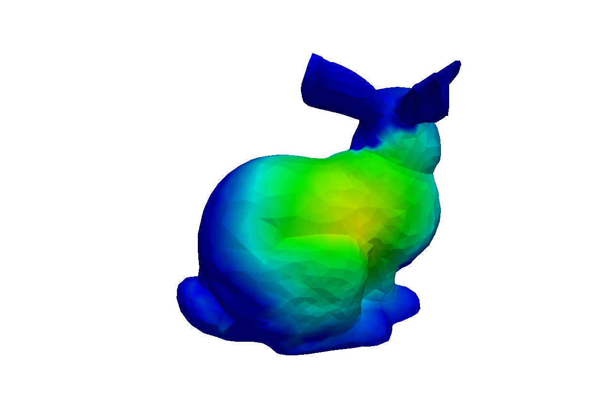
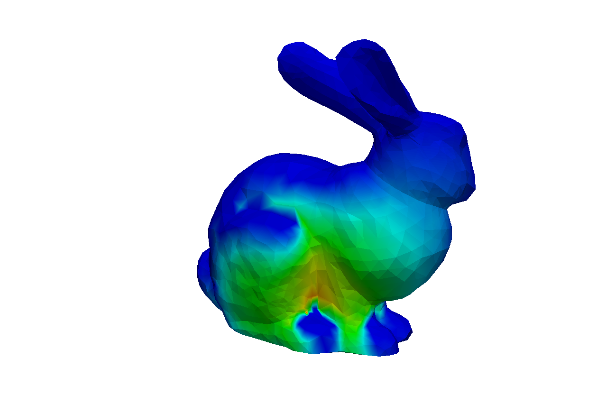
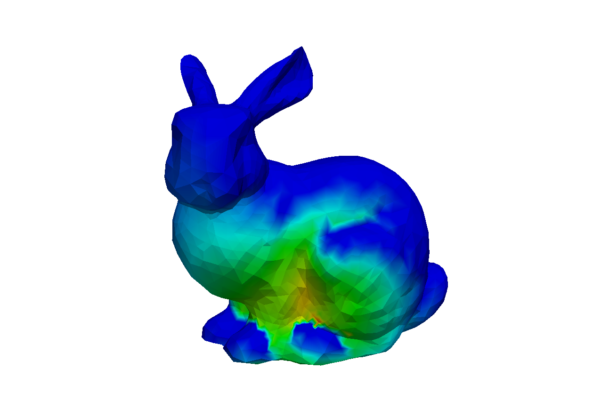

---
title: |
 | A free and open source computational tool for solving
 | (nuclear-related) differential equations in the cloud
author: German (a.k.a. Jeremy) Theler
email: gtheler@seamplex.com
institute: |
 | International Nuclear Atlantic Conference
 | Round Table 4 ENFIR Best Estimate codes and methods
 | for Reactor Physics, Thermal Fluid Dynamics and Fuel Behavior
aspectratio: 169
lang: en-US
theme: default
innertheme: rectangles
fonttheme: professionalfonts
outertheme: number
colorlinks: true
sansfont: Carlito
monofont: DejaVuSansMono
header-includes: \include{syntax.tex}
...


## Why $\rightarrow$ How $\rightarrow$ What

   
\centering 

\centering <https://www.youtube.com/watch?v=u4ZoJKF_VuA>

## 

\centering 

## IAEA 2D/3D PWR benchmark (1976)

:::::::::::::: {.columns}
::: {.column width="40%"}
{width=90%}
:::

::: {.column width="60%"}
{width=85%}
:::
::::::::::::::

## Vertical PHWR (Atucha)

:::::::::::::: {.columns}
::: {.column width="50%"}
\centering {width=70%}
:::

::: {.column width="50%"}
\centering {width=60%}
:::
::::::::::::::


## Steady-state core-level neutronic calculations

:::::::::::::: {.columns}
::: {.column width="50%"}
\centering {width=60%}
:::

::: {.column width="50%"}
\centering {width=60%}
:::
::::::::::::::


:::::::::::::: {.columns}
::: {.column width="33%"}
{width=80%}
:::

::: {.column width="34%"}
{width=80%}
:::

::: {.column width="33%"}
{width=70%}
:::
::::::::::::::


## Transient emergency boron injection---CFD

\centering 


## Transient emergency boron injection---core-level neutronics

:::::::::::::: {.columns}
::: {.column width="50%"}
\centering {width=80%}
:::

::: {.column width="50%"}
\centering {width=80%}
:::
::::::::::::::


## Transient emergency boron injection---cell-level neutronics


\centering {width=70%}


\centering {width=80%}


## 

\centering 


## A little bit of history---College (2004-2008) (v1)

 * Solve $\dot{\mathbf{x}} = F(\mathbf{x},t)$
    
    a. program an _ad-hoc_ numerical method
    b. use a standard numerical library in C or Python, or
    c. use a high-level system such as [Octave](https://www.gnu.org/software/octave/index), [Maxima](https://maxima.sourceforge.io/), etc.
    
. . .
    
 * Point reactor equations solved "graphically" with non-free software

   $$
   \begin{cases}
   \dot{\phi}(t) = \displaystyle \frac{\rho(t) - \beta}{\Lambda} \cdot \phi(t) + \sum_{i=1}^{N} \lambda_i \cdot c_i \\
   \dot{c}_i(t)  = \displaystyle \frac{\beta_i}{\Lambda} \cdot \phi(t) - \lambda_i \cdot c_i
   \end{cases}
   $$
   
. . .
   
 * I would rather write the equations in ASCII like

   ```
   phi_dot = (rho-Beta)/Lambda * phi + sum(lambda[i], c[i], i, 1, N)
   c_dot[i] = beta[i]/Lambda * phi - lambda[i]*c[i]
   ``` 

## A little bit of history---Nuclear industry (2008--2014)

. . .

\centering 

. . .

\centering Modern/Advanced $\neq$ Fortran 90

## Spatial discretizations

:::::::::::::: {.columns}
::: {.column width="50%"}
\centering {width=80%}
:::

. . .

::: {.column width="50%"}
\centering {width=80%}
:::
::::::::::::::


. . . 

:::::::::::::: {.columns}
::: {.column width="50%"}
\centering {width=80%}
:::


. . . 

::: {.column width="50%"}
\centering {width=80%}
:::
::::::::::::::

## wasora & milonga (v2)

:::::::::::::: {.columns}
::: {.column width="30%"}
\centering {width=100%}

Wasora's an advanced suite for reactor analysis

\centering {width=100%}
:::

::: {.column width="70%"}

 * Coupled unstructured fine-mesh neutronics and thermal-hydraulics methodology using open software (2018)
 * Open software one-step coupled neutronics and CFD thermalhydraulics calculation (2016)
 * <https://github.com/seamplex/milonga-2015-workshop>
 * Reactivity coefficient estimation by fuel temperature for Atucha II Nuclear Power Plant from neutron flux measurements (2014)
 * On the design basis of a new core-level neutronic code written from scratch (2014)
 * Neutron diffusion on unstructured grids: comparison between finite volumes and finite elements (2013)
 * Geometric optimization of nuclear reactor cores (2013)
 * Unstructured grids and the multigroup neutron diffusion equation (2013)

:::
::::::::::::::


## FeenoX (v3)

:::::::::::::: {.columns}
::: {.column width="50%"}

### Software Requirement Specifications

\centering <https://seamplex.com/feenox/doc/srs.html> 

 * Industrial-level: open source for V&V
 * Extensible: free (as in freedom)
 * Cloud-first: programatically-defined
 * Arbitrarily scalable for large problems
 * Flexible
 * Web & mobile-based GUIs
 * QA
   * Reproducibility & traceability
   * Automated testing
   * Bug reporting & tracking
 * V & V

 
:::

. . .

::: {.column width="50%"}
### Software Design Specifications

\centering <https://seamplex.com/feenox/doc/sds.html> 

 * GPLv3+: it is about _freedom_ not price
 * No-GUI script-friendly GNU/Linux binary
   {width=90%}\ 
 * Scalability based on UNIX
   * PETSc/SLEPc (MPI)
   * Gmsh (Metis)
 * Flexibility shown in "what"
 * Web GUI: <https://www.caeplex.com>
 * Regression testing `make check`
 * <https://github.com/seamplex/feenox>
 * V & V: TODO! (help appreciated)!
 
 
:::
::::::::::::::


## 

\centering  

## Point kinetics

:::::::::::::: {.columns}
::: {.column width="45%"}

$$
\begin{cases}
\dot{\phi}(t) = \displaystyle \frac{\rho(t) - \Beta}{\Lambda} \cdot \phi(t) + \sum_{i=1}^{N} \lambda_i \cdot c_i \\
\dot{c}_i(t)  = \displaystyle \frac{\beta_i}{\Lambda} \cdot \phi(t) - \lambda_i \cdot c_i
\end{cases}
$$

\vspace{-0.5cm}

 $t$ [s] | $\rho(t)$ [pcm]
--------:|-----------:
 0       |  0
 5       |  0
 10      | 10
 30      | 10
 35      |  0
 100     |  0 

\vspace{-0.5cm}

\noindent for $0 < t < 100$ starting from steady-steate conditions at full power.
:::

. . .

::: {.column width="55%"}
```{.feenox include="kinetics/reactivity-from-table.fee"}
```

```terminal
$ feenox reactivity-from-table.fee > flux.dat
$
```

:::
::::::::::::::

## 

\centering 

## Inverse kinetics

:::::::::::::: {.columns}
::: {.column width="50%"}
```{.feenox include="kinetics/inverse-integral.fee"}
```

. . . 

```{.feenox include="kinetics/inverse-dae.fee"}
```

:::


. . .

::: {.column width="50%"}

```terminal
$ feenox inverse-dae.fee flux.dat > inverse-dae.dat
$ feenox inverse-integral.fee flux.dat > inverse-integral.dat
```

\centering {width=80%}

\centering {width=80%}

:::
::::::::::::::


## 2D IAEA PWR Benchmark

:::::::::::::: {.columns}
::: {.column width="50%"}

```{.feenox include="iaea-2dpwr.fee"}
```

:::

::: {.column width="50%"}

```terminal
$ gmsh -2 iaea-2dpwr-quarter.geo
$ [...]
$ gmsh -2 iaea-2dpwr-eighth.geo
$ [...]
$ feenox iaea-2dpwr.fee quarter
keff =  1.02986
$ feenox iaea-2dpwr.fee eighth
keff =  1.02975
$
```

\centering {width=75%} 

:::
::::::::::::::

\centering <https://www.seamplex.com/feenox/examples/#iaea-2d-pwr-benchmark>

\centering 


## 2D IAEA PWR Benchmark

:::::::::::::: {.columns}
::: {.column width="50%"}
\centering 
:::

::: {.column width="50%"}
\centering 
:::
::::::::::::::

## 2D IAEA PWR Benchmark

:::::::::::::: {.columns}
::: {.column width="50%"}
\centering 
:::

::: {.column width="50%"}
\centering 
:::
::::::::::::::


## The $S_2$ Stanford Bunny

:::::::::::::: {.columns}
::: {.column width="50%"}

\centering {height=4cm}

:::
::: {.column width="50%"}

\vspace{1cm}

 * One-group neutron transport
 * The Stanford Bunny as the geometry
 * $S_2$ method in 3D (8 angular directions)
 * Finite elements for spatial discretization
 
:::
::::::::::::::


:::::::::::::: {.columns}
::: {.column width="25%"}
\centering {height=2cm}
:::
::: {.column width="25%"}
\centering {height=2cm}
:::
::: {.column width="25%"}
\centering {height=2cm}
:::
::: {.column width="25%"}
\centering {height=2cm}
:::
::::::::::::::
:::::::::::::: {.columns}
::: {.column width="25%"}
\centering {height=2cm}
:::
::: {.column width="25%"}
\centering {height=2cm}
:::
::: {.column width="25%"}
\centering {height=2cm}
:::
::: {.column width="25%"}
\centering {height=2cm}
:::
::::::::::::::


## Cube-sphere

:::::::::::::: {.columns}
::: {.column width="20%"}
\centering \onslide<1->{\includegraphics{cubesphere-0.png}}
:::
::: {.column width="20%"}
\centering \onslide<3->{\includegraphics{cubesphere-25.png}}
:::
::: {.column width="20%"}
\centering \onslide<3->{\includegraphics{cubesphere-50.png}}
:::
::: {.column width="20%"}
\centering \onslide<3->{\includegraphics{cubesphere-75.png}}
:::
::: {.column width="20%"}
\centering \onslide<2->{\includegraphics{cubesphere-100.png}}
:::
::::::::::::::

\centering \onslide<4->{\includegraphics[width=0.9\linewidth]{cubesphere.pdf}}


## Conclusions & TODO

:::::::::::::: {.columns}
::: {.column width="60%"}

 * 21st century: cloud-first approach
 * More formulations (milonga already had them)
    - FEM transport
    - FVM diffusion & transport
 * Massive parallelization
    - MPI through PETSc/SLEPc
    - Metis through Gmsh
 * Documentation
    - Come up with a nice logo
 * Build a community!
    - <https://github.com/seamplex/feenox/discussions>
    
:::
::: {.column width="50%"}


:::
::::::::::::::

. . .

> “It is really worth any amount of time and effort to get away from Windows if you are doing computational science.”
>
> <https://lists.mcs.anl.gov/pipermail/petsc-users/2015-July/026388.html>

. . .

\centering <https://www.youtube.com/watch?v=Q-lKK4A2OzA>

